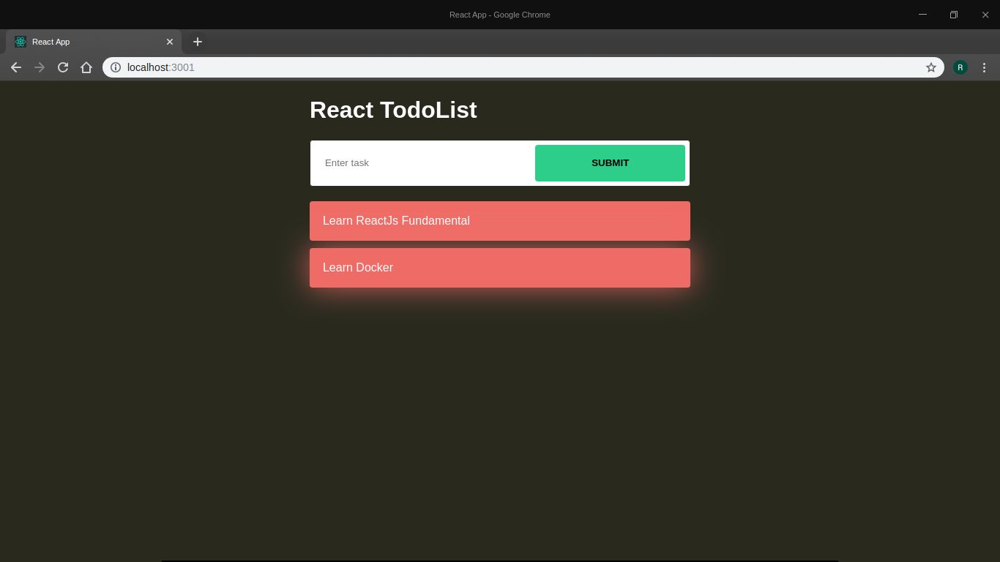

# Reactjs Todo List

This is simple practice to create todo list with react



## Installation

Clone [this repository](https://github.com/rafiudd/reactjs-todo-list)

```bash
https://github.com/rafiudd/reactjs-todo-list
```
Then install the package
```bash
npm install
```

## How to build

```python
npm run build
```
## How to start

```python
npm run start
```

## Contributing
Pull requests are welcome. For major changes, please open an issue first to discuss what you would like to change.

Please make sure to update tests as appropriate.